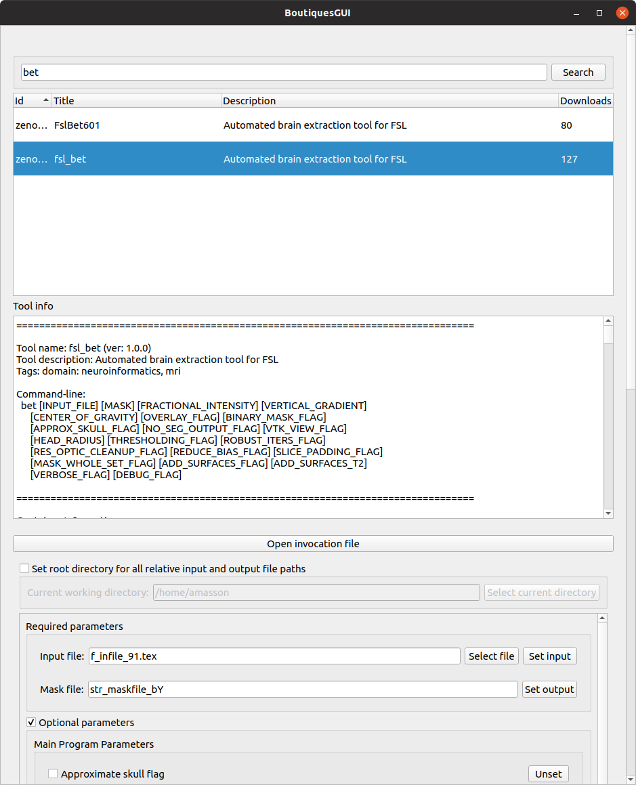

# Boutiques GUI

A small Qt GUI to search and execute Boutiques apps.

## Requirements

 - python3
 - Qt5
 - Docker or Singularity

## Install

 - Clone this repo: `git clone https://github.com/fli-iam/medinria-boutiques.git`
 - Initialize a [python3 virutal environment](https://docs.python.org/3/library/venv.html) in the *medinria-boutiques* root dir: `cd medinria-boutiques && python3 -m venv .`
 - Activate the virutal environment: `source bin/activate`
 - Install PySide2: `pip install PySide2`

## Usage

With the virutal environment activated, run `python3 main.py` from the *medinria-boutiques* root directory.